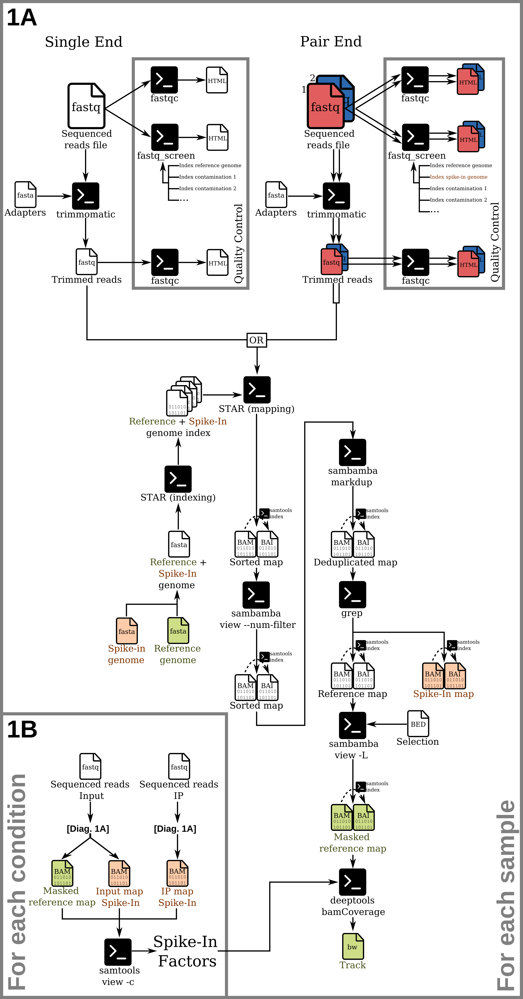
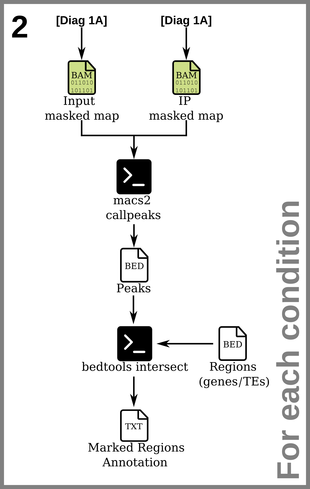
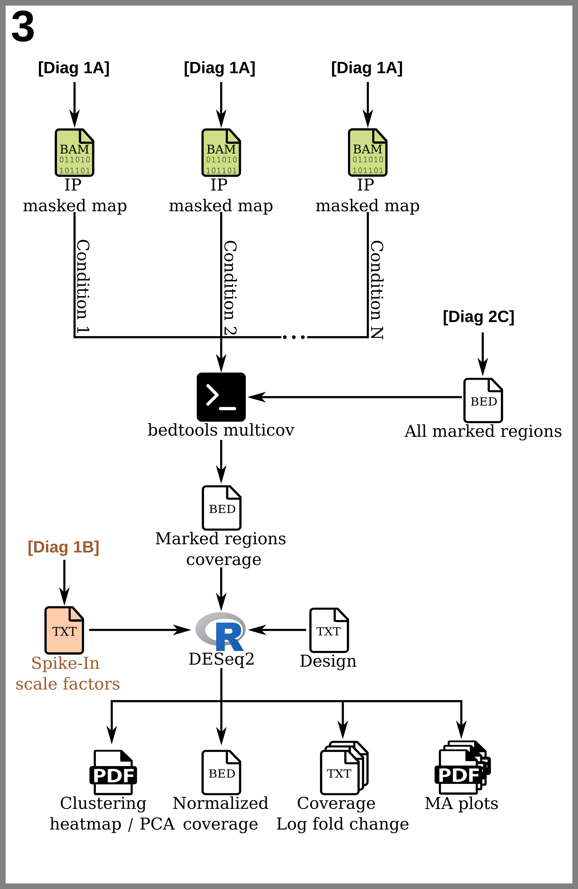

# ChIP-Rx pipeline
A pipeline for ChIP-Rx (quantitative ChIP-seq) analysis.

The following files may be needed for this pipeline:

* The reads sequencing data in `.fastq` format for each sample. May be compressed as a `.gz` archive.
  * For each experimental condition, both an input (sequencing before immuno-precipitation) and IP (sequencing after immuno-precipitation) are needed.
  * In the case of pair-end sequencing, two files per sample with matching read IDs are needed.
* The sequences of potential contaminants to control for in `.fasta` format.
* The sequences of the sequencing adapters in `.fasta` format.
* The sequence of the reference genome in `.fasta` format.
* The sequence of the foreign genetic material, introduced in the samples as the spike-in control, in `.fasta` format.
* Optionally, a `.bed` file containing a blacklist of genomic regions to exclude from the map.
* `.bed` files of the genomic regions (*e.g* genes, transposable elements, etc.) to analyse the alignment coverage on. The 4th column of those bed files must contain the identifiers of the regions. Such a file can be produced from a `.gff` annotation using this script.

Unless specified otherwise, all code samples are in the bash Unix Shell command language.

The following programs are used in this pipeline:

* [fastqc](https://www.bioinformatics.babraham.ac.uk/projects/fastqc/)
* [fastq_screen](https://www.bioinformatics.babraham.ac.uk/projects/fastq_screen/)
* [Trimmomatic](http://www.usadellab.org/cms/?page=trimmomatic)
* [bowtie2](https://bowtie-bio.sourceforge.net/bowtie2/index.shtml)
* The [samtools](https://www.htslib.org/) toolkit.
* The [sambamba](http://lomereiter.github.io/sambamba/) toolkit.
* The [bedtools](https://bedtools.readthedocs.io/en/latest/index.html) toolkit.
* [MACS2](https://pypi.org/project/MACS2/) (requires python3).
* The [deeptools](https://deeptools.readthedocs.io/en/develop/) toolkit (requires python3).
* The [R](https://www.r-project.org/) language with the following packages:
  * [DESeq2](https://bioconductor.org/packages/release/bioc/html/DESeq2.html)
  * [ggplot2](https://ggplot2.tidyverse.org/)

The following key terms are important to understand this page's instructions: 
  * **Sample**: The set of sequenced reads corresponding to a single experimental sample. For experiments using pair-end sequencing, there will be two sets of reads.
  * **Experimental condition**: Two samples, one taken before immunoprecipitation (input) and the other after (IP) constitute the data for a single experimental condition.
  * **Biological replicate**: Biological replicates are experimental conditions meant to be identical with the same genotype and environmental variables.
  * **Replicate group**: The set of all experimental conditions which are biological replicates of each other.

<table align="left" width="450" cellspacing="0" cellpadding="0">
    <tr>
        <td></td>
    </tr>
    <tr>
        <td><a href="./images/pipeline_diagrams/diagram_chiprx_1_mapping.png?raw=1">⇗Full size image</a></td>
    </tr>
    <tr>
        <td width="450"><b>Figure 1:</b> 1A:Diagram of the reads data quality control and the series of processes to produce read alignment files. Items specific to the ChIP-Rx technique are highlighted in orange. 1B:Computation of spike-in factor.</td>
    </tr>
</table>

## <a id="indexing">1) Reference genome processing and indexing</a>

The referrence genome, together with the foreign genome of the spike-in control, must be indexed. The [bowtie2-build](https://bowtie-bio.sourceforge.net/bowtie2/manual.shtml#the-bowtie2-build-indexer) command is used to create the index for [bowtie2](https://bowtie-bio.sourceforge.net/bowtie2/index.shtml) to use. This step is only needed for the very first analysis made with this reference genome and spike-in combination. The index files created by this tool can be used for any subsequent analyses.

First, we need to create a combined main orgasnism + spike-in `.fasta` genome file. The chromosomes belonging to the spike-in genome should all be denoted by a common tag that will be used to separate the alignments between genomes. This can be done with the following command:

```shell 
cat spikein_genome.bed | sed "s/>/>$SPIKE_IN_TAG/" >> reference+spikein_genome.bed
```

Then the index is built:

```shell 
bowtie2-build -threads $THREADS reference_genome.fasta reference+spikein_genome
```

The last argument (in this case `"reference+spikein_genome"` is the prefix that each file of the index will be named after. This will by default equal the name of the `.fasta` file without the extension if unspecified. Specifying it is useful to differentiate different index builds or specify the path of the directory to contain the index files.

This procedure will produce 6 files respectively to the prefix:

```
reference+spikein_genome.1.bt2
reference+spikein_genome.2.bt2
reference+spikein_genome.3.bt2
reference+spikein_genome.4.bt2
reference+spikein_genome.rev.1.bt2
reference+spikein_genome.rev.2.bt
```

All the files constituting the index should be in the same directory.

We will also require a `.bed` file describing the entire genome as genomic regions which can be produced using [this script](bedFromFasta.md) for both the reference genome alone and the combined genomes. 

```shell 
bedFromFasta.pl -i reference_genome.fasta -o reference_genome.bed
bedFromFasta.pl -i reference+spikein_genome.fasta -o reference+spikein_genome.bed
```

Some tools will require a two column file with the id and length of the chromosomes. 

```shell 
cat reference_genome.bed | cut -f 1,3 > reference_chromosome_sizes.txt
cat reference+spikein_genome.bed | cut -f 1,3 > reference+spikein_chromosome_sizes.txt
```

**Note:** The reference and spikein parts of the genome should also be indexed separately for the purpose of doing [contamination screening](#fastqscreen). For this purpose, simply repeat the above `bowtie2-build` on the individual `.fasta` files.

## 2) Quality control (optional)

This section presents some opional steps to perform quality checks on the  `.fastq` reads sequence files. 

### <a id="fastqc">2.1) Quality report</a>

The [fastqc](https://www.bioinformatics.babraham.ac.uk/projects/fastqc/) tool is used to produce quality reports on the read files. It will output a number of files in a target directory.

**Example fastqc command:**
```shell 
fastqc \
  -t $THREADS \ 
  -d tempDir/ \
  -o outputDir/ \ 
  reads.fastq
```
To be repeated for each `.fastq` reads file in the analysis.

### <a id="fastqscreen">2.2) Contamination screening</a>

The [fastq_screen](https://www.bioinformatics.babraham.ac.uk/projects/fastq_screen/) tool is used (with [bowtie2](https://bowtie-bio.sourceforge.net/bowtie2/index.shtml)) to detect and report the presence of contaminant sequences. A custom configuration file such as [this example](fastq_screen.conf) is necessary to use more than the default sequence files for detection.

Each of the `DATABASE` entries in the configuration file must be the path to a folder containing the index files produced by the same aligner tool as the `--aligner` argument indicates. In our case, we will use bowtie2. This is done as explained in the [reference genome indexing section](#indexing). One of these `DATABASE` entries should be the index of the reference genome and another should be the index of the foreign spike-in genome.

**Example fastq_screen command:**
```shell 
fastq_screen \
    --force \
    --subset 100000 \
    --threads $THREADS \
    --outdir outputDir/ \ 
    --aligner bowtie2 \
    --conf fastq_screen.conf \
    sample.fastq
```

To be repeated for each `.fastq` reads file in the analysis. 

## 3) Data processing and alignment

The pipeline for producing .bam map files from fastq sequencing files. For each map to produce, one fastq file is needed for single-end mapping while two files (one for the forward and one for the reverse sequencing) are required for pair-end mapping. The input files may used in a compressed `.gz` archive.

### 3.1) Read trimming

The [Trimmomatic](http://www.usadellab.org/cms/?page=trimmomatic) tool is used to trim the reads. The command is different between single-end and pair-end applications.

**Example single-end trimmomatic command:**
```shell 
trimmomatic SE 
    -threads $THREADS \
    -phred33 \
    sample.fastq \ 
    sample.trimmed.fastq \
    ILLUMINACLIP:adapters.fasta:2:30:10 \
    LEADING:5 TRAILING:5 MINLEN:20
```

This tool requires the adapters sequences to be provided. The numbers trailing after the name of the adapters file are the defaults (see the [documentation](http://www.usadellab.org/cms/?page=trimmomatic) for details). The `LEADING` and `TRAILING` values are phred score threshold for trimming bases. MINLEN is the the length of reads after trimming under which the reads are discarded from the dataset.

**Example pair-end trimmomatic command:**
```shell 
trimmomatic PE \
    -threads $THREADS \
    -phred33 \
    -validatePairs \
    sample_1.fastq \
    sample_2.fastq \
    sample_1.trimmed.fastq \
    sample_1.trimmed.unpaired.fastq \
    sample_2.trimmed.fastq \
    sample_2.trimmed.unpaired.fastq \
    ILLUMINACLIP:adapters.fasta:2:30:10 \
    LEADING:5 TRAILING:5 MINLEN:20
```

The files marked unpaired are unnecessary and may be deleted immediately:

```shell 
rm -f sample_*.trimmed.unpaired.fastq
```

Optionally, the fastq files produced by trimmomatic may be compressed to save space: 

```shell 
pigz -p $THREADS -v sample.trimmed.fastq
```

To be repeated for each `.fastq` reads file in the analysis.

To control the quality of the data after trimming, the [fastqc command](#fastqc) may be repeated on the trimmed files.

### 3.2) Mapping

The bowtie2 tool is used to map the reads and the samtools view command is used to compress the `.sam` output as a `.bam` file. The command is different between single-end and pair-end applications.

**Example single-end bowtie2 command:**
```shell 
bowtie2 \
    -p $THREADS  \ 
    --very-sensitive \
    -x reference+spikein_genome \
    -U sample.trimmed.fastq \ 
| samtools view -b -@ $THREADS -o sample.bam
```

The `-x` argument must be the common prefix to all the index files (without the `.*.bt2` or `.rev*.bt2`). The `--very-sensitive` argument is a preset of mapping parameters for a better but slower search for alignments.

### 3.3) Sorting

The [samtools sort](https://www.htslib.org/doc/samtools-sort.html) command is used to sort the bam file and it is indexed using samtools index. 

**Example sorting command:**
```shell 
samtools sort \
    -@ $THREADS \
    -m ${MEM_GB}g \ 
    -T tempDir/ \
    -o sample.sorted.bam \
    sample.bam \
  
samtools index -@ $THREADS sample.sorted.bam
```

### 3.4) Reads filtering

Filters are applied using [samtools sort](https://www.htslib.org/doc/samtools-sort.html). The flag used to filter ecompasses the following:

|2572||
|:----|:--------------------------------------------|
| = 4 | read unmapped |
| + 8 | pair unmapped (does nothing in single-end) |
| + 512 | read fails platform/vendor quality checks |
| + 2048 | supplementary alignment  |

**Example filtering command:**

```shell 
samtools view \
    -hb \
    -@ $THREADS \
    -F 2572 \
    -o sample.sorted.filtered.bam \
    sample.sorted.bam
    
samtools index -@ $THREADS sample.sorted.filtered.bam
```

To be repeated for each sample in the analysis. 

### 3.5) Deduplication

Optical duplicate reads are removed using the [markdup](http://lomereiter.github.io/sambamba/docs/sambamba-markdup.html) command from sambamba.

**Example deduplication script:**
```shell 
sambamba markdup -r \
        -t $THREADS \
        sample.sorted.filtered.bam \
        sample.sorted.filtered.nodup.bam \
  
samtools index -@ $THREADS sample.sorted.filtered.nodup.bam
```

To be repeated for each sample in the analysis.


### 3.6) Splitting reads between reference and spike-in

The reads aligned to the studied organism's reference genome must be separated from the reads aligned to the foreign genome added as a Spike-In control. For this purpose, we can use the `-L` option for [samtools view](https://www.htslib.org/doc/samtools-view.html) to filter the reads using the regions that do or do not contain the tag added when adding the spike in genome to the reference genome.

**Example split script:**
```shell
samtools view -h -b -@ $THREADS 
    -L <(grep $SPIKE_IN_TAG reference+spikein_genome.bed)
    sample.sorted.filtered.bam
> sample.spikein.sorted.filtered.nodup.bam
  
samtools index -@ $THREADS sample.spikein.sorted.filtered.nodup.bam
  
samtools view -h -b -@ $THREADS 
    -L <(grep -v $SPIKE_IN_TAG reference+spikein_genome.bed)
    sample.sorted.filtered.bam
| sed \"s/${SPIKE_IN_TAG}//" \
> sample.reference.sorted.filtered.nodup.bam
  
samtools index -@ $THREADS sample.reference.sorted.filtered.nodup.bam
```

To be repeated for each sample in the analysis.

### <a id="masking">3.7) Masking genomic regions</a>

A filter by region may be applied to the alignment files in order to select unwanted regions of the genome. The `-L` option for [samtools view](https://www.htslib.org/doc/samtools-view.html) allows making a selection or regions using a `.bed` file. This step can also be used to remove chromosomes we don't want to study at all such as the mitochondrial and chloroplastic chromosomes when studying the nucleic chromosomes only. This step only needs to be applied to the reference reads alignment file.

**Example masking script:**
```shell
samtools view -hb \
    -@ $THREADS \
    -L selection.bed \
    -o sample.reference.sorted.filtered.nodup.masked.bam
    sample.reference.sorted.filtered.nodup.bam \
  
samtools index -@ $THREADS sample.reference.sorted.filtered.nodup.masked.bam
```

Only positive selections may be performed with this command. To remove regions listed in a blacklist bed file, an inverse of that bed file must be generated first. Using bedtools substract, the inversion can be made in reference to a .bed of the whole reference genome:

```shell
bedtools subtract -a reference_genome.bed -b blacklist.bed > selection.bed
```

To be repeated for each sample in the analysis.

### <a id="spikeinfactors">3.8) Spike-In factors</a>

When using a Spike-In control to compare the sequencing depth of samples, we compute a scaling factor for each sample. To compute the scaling factor, the input and IP samples for an experimental condition are required, each having been split into their main organism and spike-in parts.

First, the percentage *r* of spike-in reads in each experimental condition is computed using the input sample read counts:

$$r=100*\frac{C^{Input}_{Spike-in}}{C^{Input}_{Reference}+C^{Input}_{Spike-in}}$$

Then the spike-in factor is computed as follows:

$$F=\frac{\alpha}{10^6*C^{IP}_{Spike-in}}$$

With *C* the read counts for a given sample (input or IP) and partition (reference or spike-in).

**Example scaled by spike-in factor script:**
```shell
reference_input=$(samtools view \
    -@ $THREADS \
    -c input_sample.reference.sorted.filtered.masked.nodup.bam\
)
reference_IP=$(samtools view \
    -@ $THREADS \
    -c IP_sample.reference.sorted.filtered.masked.nodup.bam\
)
spikein_input=$(samtools view \
    -@ $THREADS \
    -c input_sample.spikein.sorted.filtered.nodup.bam\
)
spikein_IP=$(samtools view \
    -@ $THREADS \
    -c IP_sample.spikein.sorted.filtered.nodup.bam\
)

(( r = 100 * spikein_input / (main_input + spikein_input) ))
(( FACTOR = r / (10**6 * spikein_IP ) ))
```

To be repeated for each experimental condition in the analysis.

### 3.9) Cleaning up (optional)

The pipeline, as presented, creates many heavy intermediate files which allows for easy backtracking but is not economical in terms of disk space.

The only map files necessary for any further work are the files produced at [the masking step](#masking). All previous `.bam` files, their associated `.bai` index files and the trimmed `.fastq` files may be deleted or archived.

## 4) Genomic tracks

This section deals with the various types of genomic tracks we may want to build in order to visualize them on the [Integrative Genomic Browser](https://igv.org/). Genomic tracks may be in `.bedgraph` (plain text) or `.bigwig` (indexed binary) format. The [bamCoverage](https://deeptools.readthedocs.io/en/develop/content/tools/bamCoverage.html) command from [deeptools](https://deeptools.readthedocs.io/en/develop/) is used to produce them. 

### 4.1) Normalized tracks

RPGC normalization can be made based on an effective genome size. The bin size will determine the resolution of the track. Optionally, the track may be smoothed for the purpose of visualization using the `--smoothLength` argument.

**Example normalized tracks script:**
```shell
bamCoverage -e \
    -p $THREAD \
    -bs $BINSIZE \
    -of bigwig \
    --normalizeUsing RPGC \
    --effectiveGenomeSize $GENOME_SIZE \
    --smoothLength $SMOOTH \
    -b sample.reference.sorted.filtered.masked.nodup.bam \
    -o sample.RPGC.bigwig
```

This can be repeated for each sample in the analysis whether input or IP.

### 4.2) Tracks scaled by spike-in factor

Ussing the [spike-in factors](#spikeinfactors) computed previously, we can rescale the tracks rather than applying a normalization.

**Example scaled by spike-in factor script:**
```shell
    
bamCoverage -e \
    -p $THREADS \
    -bs $BINSIZE \
    -of bigwig \
    --scaleFactor $FACTOR \
    --smoothLength $SMOOTH \
    -b sample.reference.sorted.filtered.masked.nodup.bam \
    -o sample.spike-in.bigwig
```

This can be repeated for each experimental condition in the analysis, producing one track each IP sample. 

### 4.3) Tracks comparison

Two tracks can be contrasted against each-other by generating a comparison track with the [bigwigCompare](https://deeptools.readthedocs.io/en/develop/content/tools/bigwigCompare.html) command from deeptools. This is useful to compare two experimental conditions or look for differences between biological replicates. The default comparisson is a log 2 fold change but other options are available with the `--operation` argument.

The input tracks must have the same bin size and they should be normalized or scaled appropriately to make the comparison meaningful. 

**Example tracks comparison script:**
```shell
bigwigCompare \
    -p $THREADS \
    -bs $BINSIZE \
    -of bigwig \
    -b1 sample1.bigwig \
    -b2 sample2.bigwig \
    -o  sample1_v_sample2.bigwig
```

### 4.4) Multi-track summary plots

The [deeptools](https://deeptools.readthedocs.io/en/develop/) toolkit also allows making summary comparisons between many tracks using the [multiBigwigSummary](https://deeptools.readthedocs.io/en/develop/content/tools/multiBigwigSummary.html) command from deeptools and using various plotting commands on its output. In this case we create a PCA plot using [plotPCA](https://deeptools.readthedocs.io/en/develop/content/tools/plotPCA.html?highlight=plotPCA) and a correlation matrix using [plotCorrelation](https://deeptools.readthedocs.io/en/develop/content/tools/plotCorrelation.html?highlight=plotCorrelation).

The input tracks must have the same bin size and they should be normalized or scaled appropriately to make the comparison meaningful.

Since the `--colors` arguments can use HTML color codes, the [color palette functions](https://stat.ethz.ch/R-manual/R-devel/library/grDevices/html/palettes.html) from the [R language](https://www.r-project.org/) are a practical way to find an appropriate color range for any number of tracks.

**Example tracks summary plots script:**
```shell
TRACKS=(sample1.bigwig sample2.bigwig ... sampleN.bigwig)
LABELS=(sample1 sample2 ... sampleN)
    
multiBigwigSummary bins \
    -p $THREADS \
    -out summary.npz \
    -b ${TRACKS[@]} \
    --labels ${LABELS[@]}
    
    
COLORS=($(Rscript -e "writeLines(paste(rainbow(${#TRACKS[@]}), collapse=' '))"))
    
plotPCA \
    --transpose \
    --corData summary.npz \
    --plotFile PCA.pdf \
    --plotFileFormat pdf \
    --colors ${COLORS[@]}
    
plotCorrelation \ 
    --corData summary.npz \
    --corMethod spearman \
    --whatToPlot heatmap \
    --plotNumbers \
    --plotFile spearman.pdf
```

Alternatively to using `.bigwig` tracks, the [multiBamSummary](https://deeptools.readthedocs.io/en/develop/content/tools/multiBamSummary.html?highlight=multiBamSummary) command can be used from `.bam` files. Using `.bigwig` files is preferable simply because they can be normalized or scaled before comparison.

<table align="left" width="450" cellspacing="0" cellpadding="0">
    <tr>
        <td></td>
    </tr>
    <tr>
        <td><a href="./images/pipeline_diagrams/diagram_chiprx_2_peaks+annotation.png?raw=1">⇗Full size image</a></td>
    </tr>
    <tr>
        <td width="450"><b>Figure 2:</b> Diagram of peak calling and peak annotation. 2A: Peak calling. 2B: Merging biological replicate reads and annotation of genomic regions. 2C: Collection of all marked genomic regions.</td>
    </tr>
</table>

## 5) Peak calling

Peak calling is used to discover genomic regions that are highly enriched in alligned reads. It is done using the [macs2 callpeak](https://hbctraining.github.io/Intro-to-ChIPseq/lessons/05_peak_calling_macs.html) command. The input and IP samples for an experimental condition are required. The command is different between single-end and pair-end applications.

### 5.1) Narrow peaks

The default mode is to call narrow peaks. This mode is sufficient for most applications. 

**Example single-end narrow peak calling command:**
```shell
macs2 callpeak \
    -q 0.01 \
    --bdg \
    -g $GENOME_SIZE \
    --tempdir tempDir/ \
    -t IP_sample.reference.sorted.filtered.masked.nodup.bam \
    -c input_sample.reference.sorted.filtered.masked.nodup.bam \
    -n sample
```

**Example pair-end narrow peak calling command:**
```shell
macs2 callpeak \
    -f BAMPE \
    -q 0.01 \
    --bdg \
    -g $GENOME_SIZE \
    --tempdir tempDir/ \
    -t IP_sample.reference.sorted.filtered.masked.nodup.bam \
    -c input_sample.reference.sorted.filtered.masked.nodup.bam \
    -n sample
```

### 5.2) Broad peaks

Broad peak calling is preferable for studying ligands that cover large genomic regions such as histone variants. It does the same peak detection as the narrow peak mode but then attempts to merge nearby highly enriched regions into broad regions. 

**Example single-end broad peak calling command:**
```shell
macs2 callpeak \
    --broad \
    -q 0.01 \
    --broad-cutoff 0.05 \
    --bdg \
    -g $GENOME_SIZE \
    --tempdir tempDir/ \
    -t IP_sample.reference.sorted.filtered.masked.nodup.bam \
    -c input_sample.reference.sorted.filtered.masked.nodup.bam \
    -n sample
```

**Example pair-end broad peak calling command:**
```shell
macs2 callpeak \
    -f BAMPE \
    --broad \
    -q 0.01 \
    --broad-cutoff 0.05 \
    --bdg \
    -g $GENOME_SIZE \
    --tempdir tempDir/ \
    -t IP_sample.reference.sorted.filtered.masked.nodup.bam \
    -c input_sample.reference.sorted.filtered.masked.nodup.bam \
    -n sample
```

The `--broad-cutoff` argument is a p-value for a test determining whether to merge neighbouring peaks.

To be repeated for each experimental condition in the analysis.

### 5.3) Merging replicate peaks

When peaks are called on multiple biological replicates of the same condition, we may want to construct a consensus of marked regions between them.

Between two replicates, this can be done, using [this script](mergeOverlappingRegions.md), which selects the regions out of each set that intersect any region of the other set so that a minimum proportion of either region is overlapped by the other and merges any overlapping regions out of the resulting selection. The value of the `-l` argument should be a number between 0 and 1.

**Example command to merge overlapping peaks out of two replicates:**
```shell
mergeOverlappingRegions.sh \
    -a sample_rep1_peaks.narrowPeak \
    -b sample_rep2_peaks.narrowPeak \
    -l $OVERLAP
> sample_merged_peaks.bed
```

### <a id="annotation">5.4) Peak annotation</a>

Using the [bedtools intersect](https://bedtools.readthedocs.io/en/latest/content/tools/intersect.html) command, we can discover which genomic regions are covered by peaks. This requires the use of a `.bed` file of the genomic regions of interest. By using the `-wo` option and filtering with `awk`, we can remove intersections under a certain length in base pair. The -sorted option makes the operation more efficient but requires the input files to be sorted by position (use [bedtools sort](https://bedtools.readthedocs.io/en/latest/content/tools/sort.html) if necessary). The peak files can already be read as sorted `.bed` files.

**Example peak annotation script:**
```shell
bedtools intersect -sorted -wo \
    -a regions.bed \
    -b sample.broadPeak \
| awk '{ if ($NF >= '"$OVERLAP"'){ print } }' \
| cut -f 4 | sort | uniq > sample_marked_regions.txt
```

For broad peaks, the peaks file generated by macs2 will end with  `.broadPeak` rather than `.narrowPeak`. Or alternatively any `.bed` file describing the coordinates of peaks may be used. This script parses the output in order to give a list of every unique region of interest marked by at least one peak.

For further purposes, both the annotation of the separate replicate peaks and of the merged peaks are of interest.

Since the set of marked regions may be different for different maps, for further procedures comparing several maps, such as [metaplots](#metaplots) or the [differential analysis](#diff), we will need to prepare a set of all regions marked for any map.

```shell
cat sample*_marked_regions.txt | sort | uniq > all_marked_regions.txt
```

We can then filter the `.bed` file of a whole set of regions with the subset of marked regions:

```shell
grep -Ff  all_marked_regions.txt regions.bed > all_marked_regions.bed
```

## <a id="metaplots">6) Metaplots</a>

Metaplots are plots that show the average alignment coverage signal profile on a set of genomic regions. To make it possible to average the signal on region segments of varrying length, the metaplot uses proportional coordinates for the interior of the segment. The `-a` and `-b` arguments allow representing the average signal on flanking regions of a given length in base pairs. Those flanking regions **do not** use normalized coordinates.

### 6.1) Compute matrix

 The [deeptools](https://deeptools.readthedocs.io/en/develop/) toolkit can be used to make Metaplots. Before roducing any plots, a matrix must be computed between the `.bigwig` coverage tracks to compare and `.bed` genomic region files to study. Any number of tracks and region sets can be loaded in.

For more relevant comparisons, it may be preferable to limit the region sets to only include regions considered as marked in the [peak annotation](#annotation). 

**Example command to compute the matrix:**
```shell
TRACKS=(sample1.bigwig sample2.bigwig ... sampleN.bigwig)
REGIONS=(regions1.bed regions2.bed ... regionsN.bed)
    
computeMatrix scale-regions -p $THREADS \
    -a 2000 -b 2000 --regionBodyLength 2000 
    --sortUsing median --sortRegions descend \
    -R ${REGIONS[@]} \
    -S ${TRACKS[@]} \
    -out matrix.tab.gz
```

### 6.2) Profile plot

From the matrix file, we can generate profile plots in several configurations. The default behaviour is to generate one plot per track on which the average profile over each regions is overlaid. The `--perGroup` argument reverses this behaviour to compare the tracks on each regions set.

Since the `--colors` arguments can use HTML color codes, the [color palette functions](https://stat.ethz.ch/R-manual/R-devel/library/grDevices/html/palettes.html) from the [R language](https://www.r-project.org/) are a practical way to find an appropriate color range for any number of tracks.

**Example profile plot command for comparing average gene profiles of different goups on each track:**
```shell
COLORS=($(Rscript -e "writeLines(paste(rainbow(${#TRACKS[@]}), collapse=' '))"))
LABELS_SAMPLES=(sample1 sample2 ... sampleN)
LABELS_SAMPLES=(genes1 genes2 ... genesN)
    
plotProfile --dpi 300 --averageType mean \
    --plotTitle "Average genes profile" \
    --startLabel "TSS"  --endLabel "TES" \
    --plotFileFormat png \
    --colors ${COLORS[@]} \
    --samplesLabel ${LABELS_REGIONS[@]} \
    --regionsLabel ${LABELS_SAMPLES[@]} \
    --matrixFile matrix.tab.gz \
    --outFileName genes_profile_perSample.png
```

**Example profile plot command for comparing average gene profiles of different tracks for each group:**
```shell
plotProfile --dpi 300 --averageType mean --perGroup \
    --plotTitle "Average genes profile" \
    --startLabel "TSS"  --endLabel "TES" \
    --plotFileFormat png \
    --colors ${COLORS[@]} \
    --samplesLabel ${LABELS_REGIONS[@]} \
    --regionsLabel ${LABELS_SAMPLES[@]} \
    --matrixFile matrix.tab.gz \
    --outFileName genes_profile_perGroup.png
```

### 6.3) Clustered heatmaps

From the same matrix file, we can produce clustered heatmaps of the genomic regions along the metaplot profiles of the different samples.

**Example genes clustering heatmap:**
```shell
plotHeatmap --dpi 300 --averageType mean \
    --plotTitle "Clustering heat map of genes" \
    --plotFileFormat png \
    --colorMap coolwarm 
    --regionsLabel ${LABELS_REGIONS[@]} \
    --samplesLabel ${LABELS_SAMPLES[@]} \
    --matrixFile matrix.tab.gz \
    --outFileName ${prefix}_heatmap.png
```
<table align="left" width="450" cellspacing="0" cellpadding="0">
    <tr>
        <td></td>
    </tr>
    <tr>
        <td><a href="./images/pipeline_diagrams/diagram_chiprx_3_differential.png?raw=1">⇗Full size image</a></td>
    </tr>
    <tr>
        <td width="450"><b>Figure 3:</b> Diagram of the differential analysis.</td>
    </tr>
</table>

## <a id="diff">7) Differential analysis</a>

The [DESeq2](https://bioconductor.org/packages/release/bioc/html/DESeq2.html) package for the [R language](https://www.r-project.org/) can be used to make a differential analysis of the coverage of different regions of the genome (genes, Transcription Elements, etc.) by aligned reads. The following packages also need to be loaded for some of code examples: [gplots](https://cran.r-project.org/web/packages/gplots/), [RColorBrewer](https://cran.r-project.org/web/packages/RColorBrewer/index.html), [ggplot2](https://ggplot2.tidyverse.org/). 

### 7.1) Multiple maps coverage

Before going to R, the coverage of regions of interest by aligned reads must be cmpuuted. This can be done for multiple maps at once using the [bedtools multicov](https://bedtools.readthedocs.io/en/latest/content/tools/multicov.html) command.

Only the regions which have been marked in the [peak annotation](#annotation) are relevant and thus the coverage only needs to be measured on a `.bed` file of the regions marked on at least one sample.

**Example bedtools multicov command:**
```shell
BAMS=(sample1.bam sample2.bam ... sampleN.bam)
    
bedtools multicov \
    -bams ${BAMS[@]} \
    -bed all_marked_regions.bed \
> all_marked_regions_coverage.bed
```

### 7.2) Building the model

First, a table describing the experimental design has to be prepared. This should at least contain the identifier for the samples and variables describing the biological replicates.

**Example experimental design table (R console output):**
```
sampleName  rep  group
A_rep1      rep1 A
A_rep2      rep2 A
B_rep1      rep1 B
B_rep2      rep2 B
...
```

From this point on, all code samples are in the [R language](https://www.r-project.org/) unlike all he above bash samples.

The experimental design table should have one row for each sample for which we computed coverage counts for the regions of interest respective to the order in which the `.bam` files were given as input. Note that only the counts for the samples after immuno-precipitation are needed.

We may then load the coverage counts file for the regions of interest. This file will have the same columns as the '.bed' file given as input to bedtools multicov and one column for each sample `.bam` file.

```R
coverage <- structure(
    read.table("regions_coverage.bed"),
    names=c(
        "chromosome", "start", "end", "name", "score", "strand", # bed file columns.
        design.tab$sampleName # counts columns.
    )
)
```

At this point, if we want to study multiple sets of genomic regions, we may merge the counts tables to load them in the same DESeq2 model. For instance, with genes and transposable element counts.

```R
coverage <- rbind(coverage.genes, coverage.TEs)
# Add column to track feature types:
coverage$type <- c( rep("gene", nrow(coverage.genes)), rep("TE", nrow(coverage.TEs)) )
```

The data are now ready to be loaded into DESeq2.

```R
dds <- DESeq2::DESeqDataSetFromMatrix(
    countData=as.matrix(coverage[design.tab$sampleName])
    colData=design.tab,
    design= ~ rep + group
)
```

The spike-in scaling factors must be added to the model.

```R
spike.factors <- read.table("spike_factors.tab")
BiocGenerics::sizeFactors(dds) <-  1 / spike.factors$factor
```

Finally, the normalization may be computed according to the model.

```R
dds <- DESeq2::DESeq(dds)
```

### 7.3) Normalized counts

We can output the normalized coverage values for a set of regions such as, in the following example, genes.

```R
write.table(
    x=data.frame(
        coverage[coverage$type == "gene", 1L:6L],
        as.data.frame(BiocGenerics::counts(dds, normalized=TRUE))[coverage$type == "gene", ]
    ),
    file="genes_coverage.DESeq-norm.bed",
    row.names=FALSE, sep="\t", quote=FALSE
)
```

### 7.4) Samples clustering heatmap and PCA

Similarly to the [multi-track summary plots](#summary) built earlier, we can produce clustering heatmap and PCA plots with the normalized coverage computed for the DESeq2 model.

First, we apply a "regularized log" transformation to the count data which normalizes with respect to library size:

```R
rld <- DESeq2::rlog(dds)
```

The ggplots library can produce a clustered heatmap plot.

```R
png(file="clustering.png", width=800L, height=800L)
gplots::heatmap.2(
    as.matrix(dist(t(SummarizedExperiment::assay(rld)))),
    trace="none",
    col=grDevices::colorRampPalette(rev(RColorBrewer::brewer.pal(9, "Blues")))(255),
    main="Clustering of protein coverage on regions", margins = c(10L, 10L)
)
dev.off()
```

The DESeq2 can perform a Principal Component Analysis that is then plotted using ggplot2.

```R
PCA_data <- DESeq2::plotPCA(rld, ntop=nrow(rld), intgroup=c("group", "rep"), returnData=TRUE)
    
ggplot2::ggsave("/PCA_protein_v_sample.png",
    ggplot2::ggplot(PCA_data, ggplot2::aes(PC1, PC2, color=group.1 , shape=rep)) +
        ggplot2::geom_point(size=3) +
        ggplot2::xlab(paste0("PC1: ", round(100 * attr(PCA_data, "percentVar"))[1], "% variance")) +
        ggplot2::ylab(paste0("PC2: ", round(100 * attr(PCA_data, "percentVar"))[2], "% variance")) +
        ggplot2::ggtitle("Total protein on regions") + 
        ggplot2::theme(plot.title=ggplot2::element_text(hjust=0.5)),
    width=5, height=5, dpi=300
)
```

### 7.5) Differentially marked regions

Any two pairs of experimental conditions can be compared by the long fold change in the coverage levels over genomic regions.

The following example extracts the results from model build on genes + TEs for group “A” and “B” on genes. A false discovery rate adjustment is applied on the results.

```R
g1 <- "A"
g2 <- "B"
    
compId <- paste0(g1, ".", g2)
sel <- coverage$type == "gene"
res <- DESeq2::results(dds, contrast=c("group", g1, g2), pAdjustMethod="fdr")[sel, ]
p.order <- order(res$padj)
res <- res[p.order, ]
ids <- coverage$name[sel][p.order]
```

We can output a table of the log fold change on all regions.
```R
write.table(
    x=data.frame(cbind(id=ids, res))
    file=paste0("/FDR_protein_on_genes_", compId, "_all.tab"), 
    quote=FALSE, sep="\t", col.names=NA
)
```

Or on only the regions which are considered differentily covered according to some p-value.

```R
pval.thr <- 0.01
write.table(
    x=data.frame(subset(cbind(id=ids, res), padj < pval.thr)),
    file=paste0("/FDR_protein_on_genes_", compId, "_diff.tab"), 
    quote=FALSE, sep="\t", col.names=NA
)
```

A scatter plot of the log fold change (called "MA-plot"). Adding horizontal line for the average log fold change to the plot is useful to view he offset caused by applying scaling factor.

```R
pval.thr <- 0.01
png(paste0(dirMAPlots_auto_genes, "/MA_protein_on_genes_", compId, ".png"), width=800L, height=800L)
DESeq2::plotMA(res, alpha=pval.thr, main=paste0("Genes: ", g1, " vs ", g2), ylim=c(-4,4))
avlfc <- mean(res$log2FoldChange)
abline(h=avlfc, lwd=2L, lty = "dashed",  col = "red")
legend( 
    x="bottomleft",
    legend=c(
        paste0("Not diff. marked (", sum(res$padj >= pval.thr, na.rm=TRUE), " total)"),
        paste0("Diff. marked (", sum(res$padj < pval.thr, na.rm=TRUE), " total)"), 
        paste0("Average log fold change (", round(avlfc, 3), ")")
    ),
    lty=c(NA, NA, "dashed"), lwd=2L, pch=c(15, 15, NA), col=c("grey", "blue", "red")
)
dev.off()
```

