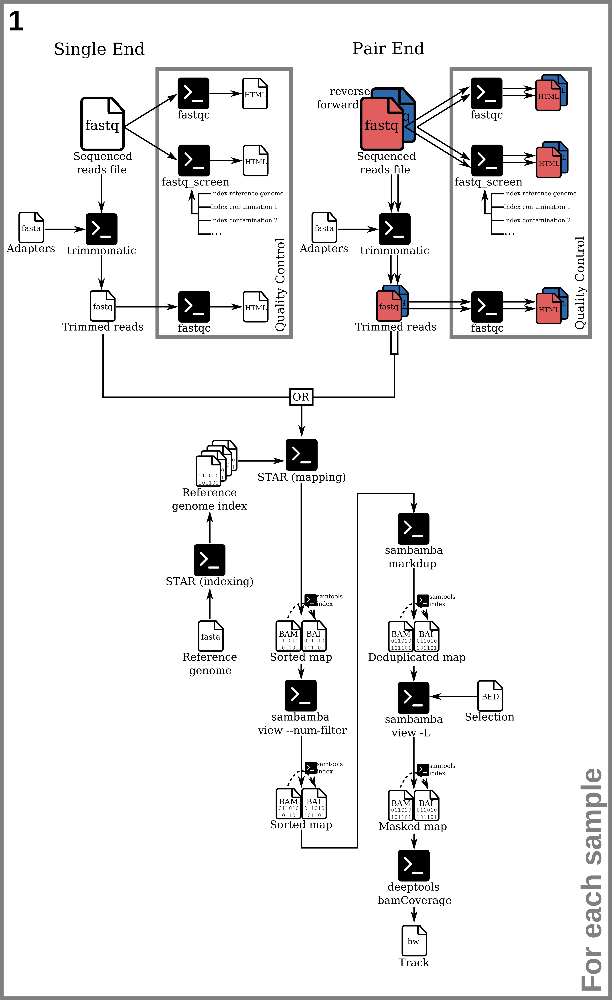
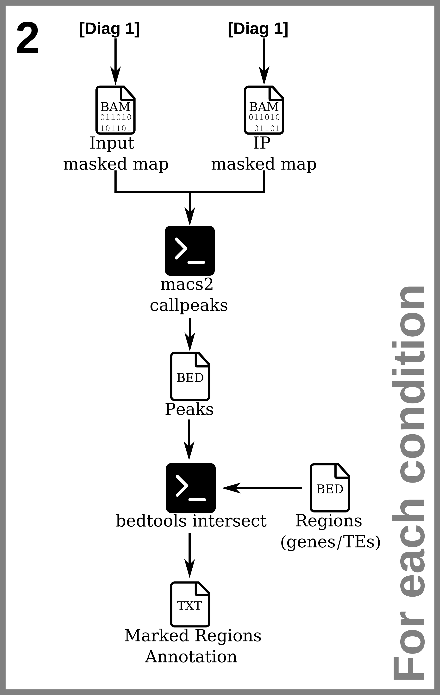

# ChIP-Seq pipeline

A pipeline for ChIP-Seq analysis.

Files requires for the ChIP-Seq pipeline:

* `FASTQ` files of read sequencing data for each sample.
  * May be compressed as a `.gz` archive.
  * In the case of paired-end sequencing, two files per sample with matching read IDs are needed.
  * For each experimental condition, both an input (sequencing before immuno-precipitation) and IP (sequencing after immuno-precipitation) are needed.
* `FASTA` files of potential contaminants to control for (optional).
* `FASTA` file of the sequences of the sequencing adapters.
* `FASTA` file of the reference genome sequence.
* `BED` file containing a blacklist of genomic regions to exclude from the alignments or at the inverse, a `BED` file of all the genomic regions *not to* exlude. (optional).
* `BED` file(s) of the genomic regions (*e.g* genes, transposable elements, etc.) to analyse the alignment coverage on. The $4^{th}$ column of those `BED` files must contain the identifiers of the regions. 
  * A `BED` file can be produced from a `GFF` annotation using the [bedFromGff.pl](bedFromGff.md) script.

See the [file formats quick reference](fileFormats.md) for more information about the types of files used and produced throughout this pipeline.

Unless specified otherwise, all code examples are in the bash Unix Shell command language.

The following programs are used in this pipeline:

* [fastqc](https://www.bioinformatics.babraham.ac.uk/projects/fastqc/) (optional)
* [fastq_screen](https://www.bioinformatics.babraham.ac.uk/projects/fastq_screen/) (optional)
* [Trimmomatic](http://www.usadellab.org/cms/?page=trimmomatic)
* [STAR](https://github.com/alexdobin/STAR).
* [bowtie2](https://bowtie-bio.sourceforge.net/bowtie2/index.shtml) (optional)
* The [sambamba](http://lomereiter.github.io/sambamba/) toolkit
* The [bedtools](https://bedtools.readthedocs.io/en/latest/index.html) toolkit
* [MACS2](https://pypi.org/project/MACS2/) (requires python3)
* The [deeptools](https://deeptools.readthedocs.io/en/develop/) toolkit (requires python3)
* The [R](https://www.r-project.org/) language with the following packages:
  * [DESeq2](https://bioconductor.org/packages/release/bioc/html/DESeq2.html)
  * [ashr](https://cran.r-project.org/web//packages/ashr/index.html)
  * [gplots](https://cran.r-project.org/web/packages/gplots/)
  * [ggplot2](https://ggplot2.tidyverse.org/)
  * [RColorBrewer](https://cran.r-project.org/web/packages/RColorBrewer/index.html)

The instructions on this page rely on the following key terms:
* **Sample:** Either the unprecipitated chromatin (input) or immunoprecipitated portion  of the chromatin (IP) of one biological replicate of one genotype in one condition.
* **Experimental condition:** An input/IP pair of samples of one genotype in one condition. Multiple biological replicates of an experimental condition can have their own or share the same input sample.
* **Biological replicate:** Samples corresponding to the same genotype and condition.
* **Replicate group:** The set of all samples which are biological replicates of each other.

<table align="left" width="450" cellspacing="0" cellpadding="0">
    <tr>
        <td></td>
    </tr>
    <tr>
        <td><a href="./images/pipeline_diagrams/diagram_chipseq_1_mapping.png?raw=1">⇗Full size image</a></td>
    </tr>
    <tr>
        <td width="450"><b>Figure 1:</b> Diagram of the reads data quality control and the series of processes to produce read alignment files.</td>
    </tr>
</table>

## 1) <a id="indexing">Reference genome indexing</a>

This section presents the indexing of the reference genome assembly for different alignment tools used throughout the pipeline. This section presents the indexing of the reference genome assemblies for different alignment tools used throughout the pipeline. These steps are only needed the first time running `STAR` or `bowtie2` on the organism's genome assembly, as the index files created by these tools can be reused for any subsequent analyses.

### 1.1) STAR index

The reference genome must be indexed by [STAR](https://github.com/alexdobin/STAR) with the `--runMode genomeGenerate` option.

The STAR manual advises using the following formula to calculate the value for the `--genomeSAindexNbases` argument of its indexing mode:

$$\LARGE{\min(14,~\frac{1}{2}*log_{2}(\sum_{i=1}^{C}L_i)-1)}$$

Where $C$ is the number of chromosomes on the genome assembly to index and $L_i$ is the length in base pairs of a chromosome $i$.

To compute this formula, first use the [bedFromFasta.pl](bedFromFasta.md) script to produce a BED file describing the entire genome:
```shell
bedFromFasta.pl -i reference_genome.fasta -o reference_genome.bed
```

Compute the formula using `R`. The example code below shows how to retrieve the result directly in `bash` with an inline call to `RScript`.

```shell
NBASES=$(Rscript -e "writeLines(as.character(as.integer(
    min(14, log2(sum( 
        read.table('reference_genome.bed')[[3L]]
    ))/2 - 1)
)))")
```

Build the index for the STAR aligner using `--runMode genomeGenerate`. The directory given as the `--genomeDir` must be empty.
```shell
STAR --runMode genomeGenerate \
  --runThreadN $THREADS \
  --genomeSAindexNbases NBASES \
  --genomeFastaFiles reference_genome.fasta \
  --genomeDir STAR_index/
```

### 1.2) <a id="bt2indexing"> bowtie2 indexes</a> (optional)

This step is necessary for [contamination screening](#fastqscreen) with [fastq_screen](https://www.bioinformatics.babraham.ac.uk/projects/fastq_screen/).

Index the reference genome `FASTA` file and the `FASTA` files of sequences for each contaminant to screen against (*e.g* human, yeast, PhIX, relevant antibody host species, etc.) with [bowtie2-build](https://bowtie-bio.sourceforge.net/bowtie2/manual.shtml#the-bowtie2-build-indexer).

```shell 
bowtie2-build -threads $THREADS reference_genome.fasta reference_genome

bowtie2-build -threads $THREADS human_genome.fasta human_genome

bowtie2-build -threads $THREADS yeast_genome.fasta yeast_genome
```

The last argument (in this case `"reference_genome"`) is the prefix that was used to name each file in the index. This will by default equal the name of the `FASTA` file without the extension if unspecified. Specifying it is useful to differentiate different index builds or to specify the path of the directory to contain the index files.

This procedure will produce 6 files respectively to the prefix:

```
reference_genome.1.bt2
reference_genome.2.bt2
reference_genome.3.bt2
reference_genome.4.bt2
reference_genome.rev.1.bt2
reference_genome.rev.2.bt
```

## 2) Quality control (optional)

This section presents two optional steps to perform quality checks on each `FASTQ` read sequence files: quality of reads and presence of contaminants.

### 2.1) <a id="fastqc">Quality report</a>

The [fastqc](https://www.bioinformatics.babraham.ac.uk/projects/fastqc/) tool produces quality reports on the read files (percentage of duplicate reads, sequence content biases and quality, etc.). It will output several files in a target directory. Apply the command below to each `FASTQ` read file.

**Example fastqc command:**
```shell 
fastqc \
  -t $THREADS \ 
  -d tempDir/ \
  -o outputDir/ \ 
  reads.fastq
```

### 2.2) <a id="fastqscreen">Contamination screening</a>

The [fastq_screen](https://www.bioinformatics.babraham.ac.uk/projects/fastq_screen/) tool is used, with [bowtie2](https://bowtie-bio.sourceforge.net/bowtie2/index.shtml), to quantify the presence of contaminant sequences in each `.fastq` read file in the analysis. A custom configuration file such as [this example](fastq_screen.conf) an be used instead of the default configuration file for detection if specific contaminants are expected (default include human, mouse, rat, worm, Drosophila, Arabidopsis, Yeast, E. coli, rRNA, mitochondria, PhiX, Lambda , Vector and Adapters).

Each of the `DATABASE` entries in the configuration file indicate the path to the folder containing the index files produced by the same aligner tool as the `--aligner` argument indicates (in our case, we will use bowtie2). This is done as explained in the [reference genome indexing section](#bt2indexing). One of these `DATABASE` entries must be the index of the reference genome. Apply the command below to each `FASTQ` read file.

**Example fastq_screen command:**
```shell 
fastq_screen \
    --force \
    --subset 100000 \
    --threads $THREADS \
    --outdir outputDir/ \ 
    --aligner bowtie2 \
    --conf fastq_screen.conf \
    sample.fastq
```

## 3) Read processing

This section presents a series of commands to produce a `BAM` for each sample.
* One `FASTQ` file is needed for single-end mapping while two files (one for the first mate and one for the second mate sequencing) are required for paired-end mapping. 
* The input files may used in a compressed `.gz` archive.

**Note: `fastq.bz2` files:** another popular compression format for `FAStQ` and other files is `.bz2`. While many tools supposedly support it natively as they do with `.gz`, some of the tools (*e.g* `fastq_screen`, `trimmomatic`) used in this pipeline presented issues when trying to use this format as input. Files can be converted from `.bz2` format to `.gz` like so:
```shell
bzcat file.fastq.bz2 | gzip - > file.fastq.gz
```

**Note: multiple files per sample:** Sometimes the reads of a sample may be split between several files. These files will need to be merged into a single file like so:
```shell
cat sample_file1.fastq sample_file2.fastq > sample.fastq
```
This command can be used with files compressed in a `.gz` or `.bz2` format (all in the same format) since pasting multiple of these archives as if they were plain text will result in a valid archive of that format. This may not work with other archive formats.

### 3.1) Read trimming

The [Trimmomatic](http://www.usadellab.org/cms/?page=trimmomatic) tool is applied to each `FASTQ` file to trim the reads. The command line is different between single-end and paired-end applications. The adapters sequences must be provided as a `FASTA` file. 

The 3 numbers added after the adapter file path are the seed mismatches, palindrome clip threshold and simple clip threshold respetively. See the [trimmomatic documentation](http://www.usadellab.org/cms/?page=trimmomatic) for details about these values. 

The `LEADING` and `TRAILING` values are phred score threshold for trimming bases. `MINLEN` is the minimum length of reads after trimming under which the reads are discarded from the dataset.

**Example single-end trimmomatic command:**
```shell 
trimmomatic SE \
    -threads $THREADS \
    -phred33 \
    sample.fastq \ 
    sample.trimmed.fastq \
    ILLUMINACLIP:adapters.fasta:2:30:10 \
    LEADING:5 TRAILING:5 MINLEN:20
```

**Example paired-end trimmomatic command:**
```shell 
trimmomatic PE \
    -threads $THREADS \
    -phred33 \
    -validatePairs \
    sample_1.fastq \
    sample_2.fastq \
    sample_1.trimmed.fastq \
    sample_1.trimmed.unpaired.fastq \
    sample_2.trimmed.fastq \
    sample_2.trimmed.unpaired.fastq \
    ILLUMINACLIP:adapters.fasta:2:30:10 \
    LEADING:5 TRAILING:5 MINLEN:20
```

The files marked unpaired are unnecessary and may be deleted immediately:

```shell 
rm -f sample_*.trimmed.unpaired.fastq
```

To save space, compress the resulting `FASTQ`: 

```shell 
pigz -p $THREADS -v sample.trimmed.fastq
```

To control the quality of the data after trimming, repeat the [fastqc command](#fastqc) trimmed reads files.

### 3.2) Mapping

[STAR](https://github.com/alexdobin/STAR) aligns reads to the reference genome. While `STAR` is built for RNAseq, setting the `--alignIntronMax` and ` --alignEndsType` options to `1` and `EndToEnd` respectively allows replicating the behaviour of other aligners for ChIP-seq. 

Arguments:
* `--readFilesIn`: indicates the input read file. If two files are given the aligner will operate in paired-end mode.
* `--readFilesCommand`: adapted to the type of compression of the input, if any (*e.g.* `cat` for an uncompressed `FASTA` file or `zcat` for a compressed `.fasta.bz` file).
* `--genomeDir`: folder in which the [index](#indexing) was produced.
* `--outSAMtype`: determines the output type, in this case a sorted `BAM` file.
* `--outFileNamePrefix`: string that prefixes the output file names (*e.g.* the alignment file name will be `<prefix>_Aligned.sortedByCoord.out.bam` for a sorted `BAM` output).
* `--outFilterMismatchNmax`: number of allowed mismatches in each alignment.
* `--outSAMmultNmax`: maximum number of alignments allowed for each read.
* `--outMultimapperOrder` how alignments with equal quality are picked out.
* `--outFilterMultimapNmax` maximum number of alignments allowed for a multimapping read before being filtered out entirely. The default value is 10. 
More information can be found in the [STAR manual](https://raw.githubusercontent.com/alexdobin/STAR/master/doc/STARmanual.pdf).

<!--- Finally, we index the alignment with [samtools index](http://www.htslib.org/doc/samtools-index.html). --->
The alignment is indexed with [sambamba index](https://lomereiter.github.io/sambamba/docs/sambamba-index.html).

**Example single-end STAR alignment command:**
<!---
```shell
samtools index -@ $THREADS sample_Aligned.sortedByCoord.out.bam
```
--->

```shell
STAR --alignIntronMax 1 --alignEndsType EndToEnd --runThreadN $THREADS \
  --readFilesIn sample.trimmed.fastq.gz --readFilesCommand zcat \
  --genomeDir STAR_index/ \
  --outTmpDir $TMP \
  --outSAMtype BAM SortedByCoordinate --outFileNamePrefix sample \
  --outFilterMismatchNmax 2 --outSAMmultNmax 1 --outMultimapperOrder Random

sambamba index -t $THREADS sample_Aligned.sortedByCoord.out.bam
```

**Example paired-end STAR alignment command:**
<!---
```shell
samtools index -@ $THREADS sample_Aligned.sortedByCoord.out.bam
```
--->

```shell
STAR --alignIntronMax 1 --alignEndsType EndToEnd --runThreadN $THREADS \
  --readFilesIn sample_1.trimmed.fastq.gz sample_2.trimmed.fastq.gz --readFilesCommand zcat \
  --genomeDir STAR_index/ \
  --outTmpDir $TMP \
  --outSAMtype BAM SortedByCoordinate --outFileNamePrefix sample \
  --outFilterMismatchNmax 2 --outSAMmultNmax 1 --outMultimapperOrder Random

sambamba index -t $THREADS sample_Aligned.sortedByCoord.out.bam
```

### 3.3) Reads filtering

Filters are applied using  [sambamba view](https://lomereiter.github.io/sambamba/docs/sambamba-view.html). The flag used to filter ecompasses the following:
<!--- Filters are applied using [samtools view](https://www.htslib.org/doc/samtools-view.html). The flag used to filter ecompasses the following: --->

|2572||
|:----|:--------------------------------------------|
| = 4 | read unmapped |
| + 8 | pair unmapped (does nothing in single-end) |
| + 512 | read fails platform/vendor quality checks |
| + 2048 | supplementary alignment  |

**Example filtering command:**
<!---
```shell
samtools view \
    -hb \
    -@ $THREADS \
    -F 2572 \
    -o sample.filtered.bam \
    sample_Aligned.sortedByCoord.out.bam
  
samtools index -@ $THREADS sample.filtered.bam
```
--->

```shell
sambamba view \
    -h -f bam \
    -t $THREADS \
    --num-filter /2572 \
    -o sample.filtered.bam \
    sample_Aligned.sortedByCoord.out.bam

sambamba index -t $THREADS sample.filtered.bam
```

To be run for each sample in the analysis. 

### 3.4) Deduplication

Optical duplicate reads are removed using [sambamba markdup](http://lomereiter.github.io/sambamba/docs/sambamba-markdup.html).

**Example deduplication script:**
<!---
```shell
samtools index -@ $THREADS sample.filtered.nodup.bam
```
--->

```shell 
sambamba markdup -r \
    -t $THREADS \
    --tmpdir $TMP \
    sample.filtered.bam \
    sample.filtered.nodup.bam \
  
sambamba index -t $THREADS sample.filtered.nodup.bam
```

To be run for each sample in the analysis.

### 3.5) <a id="masking">Masking genomic regions</a>

<!--- [samtools view](https://www.htslib.org/doc/samtools-view.html) --->
Some problematic regions of the genome can be filtered out from the alignment files.  The `-L` option of [sambamba view](https://lomereiter.github.io/sambamba/docs/sambamba-view.html) allows making a selection of regions using a `BED` file. This step can also be used to remove chromosomes we don't want to study at all such as the mitochondrial and chloroplastic chromosomes when studying the nucleic chromosomes only.

**Example masking script:**
<!---
```shell
samtools view -h -b \
    -@ $THREADS \
    -L selection.bed \
    -o sample.reference.filtered.nodup.masked.bam \
    sample.reference.filtered.nodup.bam \
  
samtools index -@ $THREADS sample.reference.filtered.nodup.masked.bam
```
--->

```shell
sambamba view -h -f bam \
    -t $THREADS \
    -L selection.bed \
    -o sample.reference.filtered.nodup.masked.bam \
    sample.reference.filtered.nodup.bam

sambamba index -t $THREADS sample.reference.filtered.nodup.masked.bam
```

Only positive selections may be performed with this command. To remove regions listed in a blacklist bed file, an inverse of that bed file must be generated first. Using bedtools substract, the inversion can be made in reference to a `BED` of the whole reference genome:

```shell
bedtools subtract -a reference_genome.bed -b blacklist.bed > selection.bed
```

To be run for each sample in the analysis.

### 3.6) Cleaning up (optional)

The pipeline, as presented, creates many heavy intermediate files which allows for easy backtracking but is not economical in terms of disk space.

The only alignment files which are necessary for any further work are the files produced at [the masking step](#masking). All previous `BAM` files, their associated `BAI` index files and the trimmed `FASTQ` files may be deleted or archived.

It is however advised to keep intermediate files if possible to be able to resume from any step if needed.

<table align="left" width="450" cellspacing="0" cellpadding="0">
    <tr>
        <td></td>
    </tr>
    <tr>
        <td><a href="./images/pipeline_diagrams/diagram_chipseq_2_peaks+annotation.png?raw=1">⇗Full size image</a></td>
    </tr>
    <tr>
        <td width="450"><b>Figure 2:</b> Diagram of peak calling and annotation.</td>
    </tr>
</table>

## 4) Peak calling and annotation

Peak calling is used to discover genomic regions that are highly enriched in alligned reads. It is done using the [macs2 callpeak](https://hbctraining.github.io/Intro-to-ChIPseq/lessons/05_peak_calling_macs.html) command. The input and IP samples for an experimental condition are required. The command is different between single-end and paired-end applications. A p-value threshold (`-q` argument) of 0.01 is a good starting point but it must be evaluated empirically for each study.

### 4.1) Narrow peaks

The default mode is to call narrow peaks. This mode is sufficient for most applications. 

**Example single-end narrow peak calling command:**
```shell
macs2 callpeak \
    -q 0.01 \
    --bdg \
    -g $GENOME_SIZE \
    --tempdir tempDir/ \
    -t IP_sample.filtered.masked.nodup.bam \
    -c input_sample.filtered.masked.nodup.bam \
    -n sample
```

**Example paired-end narrow peak calling command:**
```shell
macs2 callpeak \
    -f BAMPE \
    -q 0.01 \
    --bdg \
    -g $GENOME_SIZE \
    --tempdir tempDir/ \
    -t IP_sample.filtered.masked.nodup.bam \
    -c input_sample.filtered.masked.nodup.bam \
    -n sample
```

### 4.2) Broad peaks

Broad peak calling is preferable for studying chromatin marks or binding protein that span over several nucleosomes such as marks covering entire gene bodies (Ex. H2Bub, H3K36me3 or H3K27me3). It does the same peak detection as the narrow peak mode but then attempts to merge nearby highly enriched regions into broad regions. 

**Example single-end broad peak calling command:**
```shell
macs2 callpeak \
    --broad \
    -q 0.01 \
    --broad-cutoff 0.05 \
    --bdg \
    -g $GENOME_SIZE \
    --tempdir tempDir/ \
    -t IP_sample.filtered.masked.nodup.bam \
    -c input_sample.filtered.masked.nodup.bam \
    -n sample
```

**Example paired-end broad peak calling command:**
```shell
macs2 callpeak \
    -f BAMPE \
    --broad \
    -q 0.01 \
    --broad-cutoff 0.05 \
    --bdg \
    -g $GENOME_SIZE \
    --tempdir tempDir/ \
    -t IP_sample.filtered.masked.nodup.bam \
    -c input_sample.filtered.masked.nodup.bam \
    -n sample
```

The `--broad-cutoff` argument is a p-value for a test determining whether to merge neighbouring peaks.

To be run for each experimental condition in the analysis.

<!--- 

### 5.3) Merging replicate peaks

When peaks are called on multiple biological replicates of the same condition, we may want to construct a consensus of marked regions between them with a single set of coordinates for the regions marked in both replicates.

Between two replicates, this can be done, using the [mergeOverlappingRegions.sh](mergeOverlappingRegions.md) script, which selects the regions out of each set that intersect any region of the other set so that a minimum proportion of either region is overlapped by the other and merges any overlapping regions out of the resulting selection. The value of the `-l` argument should be a number between 0 and 1.

**Example command to merge overlapping peaks out of two replicates:**
```shell
mergeOverlappingRegions.sh \
    -a sample_rep1_peaks.narrowPeak \
    -b sample_rep2_peaks.narrowPeak \
    -l $OVERLAP
> sample_merged_peaks.bed
```

--->

### 4.3) <a id="annotation">Peak annotation</a>

Using the [bedtools intersect](https://bedtools.readthedocs.io/en/latest/content/tools/intersect.html) command, we can discover which genomic regions (such as genes, transposable elements or any other loci of interest) are covered by peaks. This requires the use of a `BED` file of the genomic regions of interest. By using the `-wo` option and filtering with `awk`, we can remove intersections under a certain length in base pair. The -sorted option makes the operation more efficient but requires the input files to be sorted by position (use [bedtools sort](https://bedtools.readthedocs.io/en/latest/content/tools/sort.html) if necessary). The peak files already are sorted `BED` files. `cut` is then used to extract the column of region identifiers to obtain a set of regions without duplicates using `sort` and `uniq`. `grep` is then used to extract the lines in the original regions file which corresponds to those identifiers. Finally, bedtols can be used to sort the resulting bed file by positions.

**Example peak annotation script:**
```shell
bedtools intersect -sorted -wo \
    -a regions.bed \
    -b sample_peaks.narrowPeak \
| awk '{ if ($NF >= '"$OVERLAP"'){ print } }' \
| cut -f 4 | sort | uniq 
| grep -Ff - ${regions_bed} | bedtools sort > sample_marked_regions.bed
```

For broad peaks, the peaks file generated by macs2 will end with  `_peaks.broadPeak` rather than `_peaks.narrowPeak`. Or alternatively any `BED` file describing the coordinates of peaks may be used. 
The output is then parsed in order to obain a list of every unique region of interest marked by at least one peak.

<!---
 
For further purposes, both the annotation of the separate replicate peaks and of the merged peaks are of interest.

Since the set of marked regions may be different for different maps, for further procedures comparing several samples, such as [metaplots](#metaplots) or the [differential analysis](#diff), we will need to prepare a set of all regions marked for any alignment.

```shell
cat sample*_marked_regions.txt | sort | uniq > all_marked_regions.txt
```

We can then filter the `BED` file of a whole set of regions with the subset of marked regions:

```shell
grep -Ff  all_marked_regions.txt regions.bed > all_marked_regions.bed
```

--->

## 5) Genomic tracks

This section deals with the various types of genomic tracks we may want to build in order to visualize them on the [Integrative Genomic Browser](https://igv.org/) as well as produce metaplots. Genomic tracks may be in `BedGraph` (plain text) or `BigWig` (indexed binary) format. The [bamCoverage](https://deeptools.readthedocs.io/en/develop/content/tools/bamCoverage.html) command from [deeptools](https://deeptools.readthedocs.io/en/develop/) is used to produce them.

### 5.1) Normalized tracks

RPKM normalization can be applied to generate comparable genomic tracks. The bin size will determine the resolution of the track. Optionally, the track may be smoothed for the purpose of visualization using the `--smoothLength` argument.
The commands for single-end or paired-end differ in that the `-e` (extend reads) option must be followed with a value for the fragents length for single-end cases while this is automaticaly determined by the read mates in paired-end cases.

**Example single-end normalized tracks script:**
```shell
bamCoverage -e $FRAGLENGTH \
    -p $THREAD \
    -bs $BINSIZE \
    -of bigwig \
    --normalizeUsing RPKM \
    --smoothLength $SMOOTH \
    -b sample.filtered.masked.nodup.bam \
    -o sample.RPKM.bigwig
```

**Example paired-end normalized tracks script:**
```shell
bamCoverage -e \
    -p $THREAD \
    -bs $BINSIZE \
    -of bigwig \
    --normalizeUsing RPKM \
    --smoothLength $SMOOTH \
    -b sample.filtered.masked.nodup.bam \
    -o sample.RPKM.bigwig
```

This can be repeated for each sample in the analysis whether input or IP.

### 5.2) Average tracks

The average of multiple tracks, such as a set of biological replicate tracks, can generated using the [bigwigAverage](https://deeptools.readthedocs.io/en/develop/content/tools/bigwigAverage.html) command from deeptools. 

The given tracks must have the same bin size and they should be normalized or scaled appropriately to make the comparison meaningful. 

**Example average track script:**
```shell
TRACKS=(sample_condition_rep1.bigwig sample_condition_rep2.bigwig ... sample_condition_repN.bigwig)

bigwigAverage 
    -p $THREAD \
    -bs $BINSIZE \
    -b ${TRACKS[@]} \
    -o sample_condition_average.bigwig
```

### 5.3) Tracks comparison

Two tracks can be contrasted against each other by generating a comparison track with the [bigwigCompare](https://deeptools.readthedocs.io/en/develop/content/tools/bigwigCompare.html) command from deeptools. This is useful to compare two experimental conditions with a log2-fold-change track for instance. Other options are available with the `--operation` argument.

The given tracks must have the same bin size and be normalized in the same way to make the comparison meaningful. 

**Example tracks comparison script:**
```shell
bigwigCompare \
    -p  $THREADS \
    -bs $BINSIZE \
    -of bigwig \
    -b1 sample1.bigwig \
    -b2 sample2.bigwig \
    --operation log2 \
    -o  sample1_v_sample2.bigwig
```

### 5.4) <a id="summary">Multi-track summary plots</a>

A PCA and correlation heatmap analyses are made using `deeptools`'s [multiBigwigSummary](https://deeptools.readthedocs.io/en/develop/content/tools/multiBigwigSummary.html) on the `BigWig` tracks (or [multiBamSummary](https://deeptools.readthedocs.io/en/develop/content/tools/multiBamSummary.html?highlight=multiBamSummary) on the `BAM` alignment files) followed by [plotPCA](https://deeptools.readthedocs.io/en/develop/content/tools/plotPCA.html?highlight=plotPCA) and [plotCorrelation](https://deeptools.readthedocs.io/en/develop/content/tools/plotCorrelation.html?highlight=plotCorrelation) respectively. 

The given tracks must have the same bin size and be normalized in the same way to make the comparison meaningful.

Since the `--colors` arguments can use HTML color codes, the [color palette functions](https://stat.ethz.ch/R-manual/R-devel/library/grDevices/html/palettes.html) from the [R language](https://www.r-project.org/) are a practical way to find an appropriate color sets for any number of tracks.

**Example tracks summary plots script:**
```shell
TRACKS=(sample1.bigwig sample2.bigwig ... sampleN.bigwig)
LABELS=(sample1 sample2 ... sampleN)
    
multiBigwigSummary bins \
    -p $THREADS \
    -out summary.npz \
    -b ${TRACKS[@]} \
    --labels ${LABELS[@]}
    
    
COLORS=($(Rscript -e "writeLines(paste(rainbow(${#TRACKS[@]}), collapse=' '))"))
    
plotPCA \
    --transpose \
    --corData summary.npz \
    --plotFile PCA.pdf \
    --plotFileFormat pdf \
    --colors ${COLORS[@]}
    
plotCorrelation \ 
    --corData summary.npz \
    --corMethod spearman \
    --whatToPlot heatmap \
    --plotNumbers \
    --plotFile spearman.pdf
```

## 6) <a id="metaplots">Region metaplots and heatmaps</a>

<table align="left" width="1000" cellspacing="0" cellpadding="0">
    <tr>
        <td></td>
    </tr>
    <tr>
        <td><a href="./images/pipeline_diagrams/diagram_chipseq_3_metaplots.png?raw=1">⇗Full size image</a></td>
    </tr>
    <tr>
        <td width="1000"><b>Figure 3:</b> Diagram of metaplot building.</td>
    </tr>
</table>

The [deeptools](https://deeptools.readthedocs.io/en/develop/) toolkit can be used to make plots that summarize the alignment signal across a number of samples on a number of sets of regions. The two types of plot that can be produced are metaplots, which show combined profile curves of the signal or correlation heatmaps of the regions.

### 6.1) Build the set of genomic regions

At this point we have individual [peak annotations](#annotation) for each sample. We need to collect those annotations together into a single set. If there are multiple biological replicates for a condition, we can select only the regions that appear in all replicates:

```shell
ANNOT=( condition_rep1_marked_regions.txt condition_rep2_marked_regions.txt ... )

awk '{print $0}' ${ANNOT[@]} | sort | awk "++seen[\$0] >= ${#ANNOT[@]}" | uniq > condition_marked_regions.bed
```

The above command takes any number of files (in this case annotation files and outputs the lines which appear as many times as there are files, thus only outputing the regions which appear in all annotations. This essentially performs an intersection of all the files.

The sets of regions of all conditions can then be merged into a single file. This time, we want to perform a union of the regions into a single file.

```shell
ANNOT=( condition1_marked_regions.txt condition2_marked_regions.txt condition3_marked_regions.txt ... )

awk '{print $0}' ${ANNOT[@]} | sort | uniq > all_marked_regions.bed
```

These commands can be repeated for whatever sets of regions have been annotated (genes, TEs, etc).

### 6.2) Compute matrix

Before producing any plots, a matrix must be computed between the `BigWig` coverage tracks to compare and `BED` genomic region files to study. Any number of tracks and region sets can be loaded in. 

`computeMatrix` has two modes:
    - `scale-regions`: Will scale the signal on every region in the same set to a determined length (`--regionBodyLength`) before calculating the combination of the signal in that rescaled region. Arguments `--upstream` and `--downstream` can be used to add flanking regions on either side of the region. This flanking signal is not rescaled. This mode is useful for instance to compare the amount of marking on the gene body between different samples and to see the distribution of that signal on the body and its flanking regions. 
    - `reference-point` : Will show the combined signal on a range of distance centered on the same point of every region: the start (`"TSS"`), the end (`"TTS"`) or the middle (`"center"`). No rescaling is done on the signal. This mode is useful to obtain an undistorted view of the combined signal around the point of reference which may be useful to view offsets of the signal profiles between samples.


**Example command to compute the matrix in scale-regions mode:**
```shell
TRACKS=(sample1.bigwig sample2.bigwig ... sampleN.bigwig)
REGIONS=(regions1.bed regions2.bed ... regionsN.bed)
    
computeMatrix scale-regions -p $THREADS \
    -R ${REGIONS[@]} \
    -S ${TRACKS[@]} \
    --upstream 2000 --downstream 2000 --regionBodyLength 2000 
    --averageTypeBins median \
    -out matrix.tab.gz
```

It is advised to not use smoothed tracks that would reduce the accuracy of the calculations.

**Example command to compute the matrix inreference-point mode:**
```shell
TRACKS=(sample1.bigwig sample2.bigwig ... sampleN.bigwig)
REGIONS=(regions1.bed regions2.bed ... regionsN.bed)
    
computeMatrix reference-point -p $THREADS \
    -R ${REGIONS[@]} \
    -S ${TRACKS[@]} \
    --upstream 2000 --downstream 2000 --referencePoint TSS 
    --averageTypeBins median \
    -out matrix.tab.gz
```

**Note:** In this command `--averageTypeBins` does not determine the statistic used to combine signals from the same regions as this calculation is not done in this step. This argument only determines when dealing with input `BigWig` files with different bun sizes.

### 6.3) Profile plot

From the matrix file, we can generate combined profile plots in several configurations. The default behaviour is to generate one plot per track on which the average profile over each regions is overlaid. The `--perGroup` argument reverses this behaviour to compare the tracks on each regions set. The statistic used to combine the profile is determined by the `--averageType` argument.

Since the `--colors` arguments can use HTML color codes, the [color palette functions](https://stat.ethz.ch/R-manual/R-devel/library/grDevices/html/palettes.html) from the [R language](https://www.r-project.org/) are a practical way to find an appropriate color range for any number of tracks.

If the matrix file was created in `scale-regions` mode, the `--startLabel` `--endLabel` can be used to label the edges of the region body while  `--refPointLabel` is used for a `reference-point` mode matrix.

The `--outFileNameData` option can be added so that a text table of the profiles will be written alongside the plot image. This file can then be used to generate more customized plots using other tools.

**Example profile plot command for comparing average gene profiles of different goups on each track:**
```shell
COLORS=($(Rscript -e "writeLines(paste(rainbow(${#TRACKS[@]}), collapse=' '))"))
LABELS_SAMPLES=(sample1 sample2 ... sampleN)
LABELS_REGIONS=(genes1 genes2 ... genesN)
    
plotProfile --dpi 300 --averageType median \
    --plotTitle "Average genes profile" \
    --startLabel "TSS"  --endLabel "TES" \
    --colors ${COLORS[@]} \
    --samplesLabel ${LABELS_SAMPLES[@]} \
    --regionsLabel ${LABELS_REGIONS[@]} \
    --matrixFile matrix.tab.gz \
    --outFileName genes_profile_perSample.pdf
```

**Example profile plot command for comparing average gene profiles of different tracks for each group:**
```shell
plotProfile --perGroup --dpi 300 --averageType median \
    --plotTitle "Average genes profile" \
    --startLabel "TSS"  --endLabel "TES" \
    --colors ${COLORS[@]} \
    --samplesLabel ${LABELS_SAMPLES[@]} \
    --regionsLabel ${LABELS_REGIONS[@]} \
    --matrixFile matrix.tab.gz \
    --outFileName genes_profile_perGroup.pdf
```

### 6.4) Heatmaps

From the same matrix file, we can produce clustered heatmaps of the genomic regions along the metaplot profiles of the different samples. Similatrly to `plotProfile`, the `--perGroup` argument can be used.

**Example genes clustering heatmap (per sample):**
```shell
plotHeatmap --dpi 300 \
    --plotTitle "Clustering heat map of genes" \
    --colorMap coolwarm 
    --samplesLabel ${LABELS_SAMPLES[@]} \
    --regionsLabel ${LABELS_REGIONS[@]} \
    --matrixFile matrix.tab.gz \
    --outFileName genes_profile_perSample.pdf
```

**Example genes clustering heatmap (per group):**
```shell
plotHeatmap --perGroup --dpi 300 \
    --plotTitle "Clustering heat map of genes" \
    --colorMap coolwarm 
    --samplesLabel ${LABELS_SAMPLES[@]} \
    --regionsLabel ${LABELS_REGIONS[@]} \
    --matrixFile matrix.tab.gz \
    --outFileName genes_profile_perGroup.pdf
```

<table align="left" width="1000" cellspacing="0" cellpadding="0">
    <tr>
        <td></td>
    </tr>
    <tr>
        <td><a href="./images/pipeline_diagrams/diagram_chipseq_4_differential.png?raw=1">⇗Full size image</a></td>
    </tr>
    <tr>
        <td width="1000"><b>Figure 4:</b> Diagram of the differential analysis.</td>
    </tr>
</table>

## 7) <a id="diff">Differential analysis</a>

A differential analysis of the coverage over genes and transposable elements is made using the [DESeq2](https://bioconductor.org/packages/release/bioc/html/DESeq2.html) package for the [R language](https://www.r-project.org/). The following packages also need to be loaded:
- [gplots](https://cran.r-project.org/web/packages/gplots/)
- [RColorBrewer](https://cran.r-project.org/web/packages/RColorBrewer/index.html)
- [ggplot2](https://ggplot2.tidyverse.org/).

### 7.1) Universe of peaks annotation
For the purpose of the differential analysis, rather than the conservative annotation used in drawing [metaplots](#metaplots), a more permissive set can be built under the assumption that any falsely annotated regions will be identified as statistically insignificant in the differntial analysis. The first step in the construction of this annotation is to merge the peaks of all the samples in the experiment to build single set of peaks. This is done using [bedtools merge](https://bedtools.readthedocs.io/en/latest/content/tools/merge.html).

```shell
BEDS=( sample1_peaks.narrowPeak sample2_peaks.narrowPeak ... sampleN_peaks.narrowPeak)

cat ${BEDS[@]} | bedtools sort | bedtools merge > universe_of_peaks.bed
```

**Note:** Peak files will either end with `.narrowPeak` or `.broadPeak` depending on the method used.

This "universe of peaks" file is then annotated as presented in [peak annotation](#annotation) on each set of regions to study in the differential analysis.

### 7.2) <a id=coverage>Multiple maps coverage</a>

Before going to R, the read coverage of regions of interest (genes, TEs, etc.) by aligned reads must be computed. This can be done for multiple samples at once using the [bedtools multicov](https://bedtools.readthedocs.io/en/latest/content/tools/multicov.html) command.

Only the regions which have been marked in the [peak annotation](#annotation) are relevant and thus the coverage only needs to be measured on a `BED` file of the regions marked on at least one sample (produced in the last step of the peak annotation).

**Example bedtools multicov command:**
```shell
BAMS=(sample1.bam sample2.bam ... sampleN.bam)
    
bedtools multicov \
    -bams ${BAMS[@]} \
    -bed universe_of_peaks_annotation.bed \
> universe_of_peaks_annotation_coverage.bed
```

If multiple types of regions (genes, TEs, etc.) have been annotated on the peaks, this procedure may be repeated on the total set of marked regions of that type.

Running `bedtools multicov` on many `BAM` files can be quite time consuming since this command only uses one thread. It may then be preferable to process the bams in parallel and collect the individual outputs in a single coverage file afterwards.

```shell
BAMS=(sample1.bam sample2.bam ... sampleN.bam)

parallel -j ${threads} "bedtools multicov -bams {} -bed universe_of_peaks_annotation.bed > ${TMP}/{/.}.bed" ::: ${BAMS[@]}

for bed in $(ls ${TMP}/*.bed)
do
    inserts+=("<(cut -f 4 ${bed})")
done

paste <(cut -f 1-3 universe_of_peaks_annotation.bed) ${inserts[@]} > universe_of_peaks_annotation_coverage.bed
```

**Note:** The annotation file must be sorted for `bedtools multicov` to work. Use [bedtools sort](https://bedtools.readthedocs.io/en/latest/content/tools/sort.html) if necessary.

### 7.3) Building the model

The table describing the experimental design contains a unique name for each sample and as many variables as necessary to describe the samples (genotype, condition, replicate, etc.). Consider to only add a variable if there is a reason that it should contribute to the variability. For example, a `replicate` variable if there could be a potential batch effect between replicate groups (different plant seed lots, experiments done at a different time or place, etc.). We will use the example design below going forward but this should be adapted to the experimental design.

**Example experimental design table (R console output):**
```
sampleName  genotype    condition   replicate
WT_L_rep1   WT          Light       Rep1
WT_L_rep2   WT          Light       Rep2
mut_L_rep1  mut         Light       Rep1
mut_L_rep2  mut         Light       Rep2
WT_D_rep1   WT          Dark        Rep1
WT_D_rep2   WT          Dark        Rep2
mut_D_rep1  mut         Dark        Rep1
mut_D_rep2  mut         Dark        Rep2
...
```

The experimental design table should have one row for each sample in the same order as in the previously built [coverage table](#coverage).

From this point on, all code examples are in the [R language](https://www.r-project.org/) unlike all the above bash code examples.

Load the coverage counts file for the regions of interest.
```R
coverage <- structure(
    read.table("regions_coverage.bed"),
    names=c(
        "chrom", "chromStart", "chromEnd", "name", "score", "strand", # bed file columns.
        design.tab$sampleName # counts columns.
    )
)
```

At this point, if we want to study multiple sets of genomic regions, we may merge the counts tables to load them in the same DESeq2 model. For instance, with genes and transposable element counts.

```R
coverage <- rbind(coverage.genes, coverage.TEs)
# Add column to track feature types:
coverage$type <- c( rep("gene", nrow(coverage.genes)), rep("TE", nrow(coverage.TEs)) )
```

The data are now ready to be loaded into DESeq2. The design equation should contain the same variables specified in the design table above (`design.tab`). 

```R
dds <- DESeq2::DESeqDataSetFromMatrix(
    countData=as.matrix(coverage[design.tab$sampleName])
    colData=design.tab,
    design= ~ genotype + condition + replicate
)
```

**Note:** In some experiments, variables may interact with one another which can be represented by interraction terms in the form `variable1:variable2`. In our example, a model with `~ genotype + condition + genotype:condition + replicate` would represent an interraction between genotype and condition.

Finally, the model can be fitted by `DESeq2`.
```R
dds <- DESeq2::DESeq(dds)
```

### 7.4) Normalized counts

We can output the normalized coverage values for a set of regions such as, in the following example, genes.

```R
write.table(
    x=data.frame(
        coverage[coverage$type == "gene", 1L:6L],
        as.data.frame(BiocGenerics::counts(dds, normalized=TRUE))[coverage$type == "gene", ]
    ),
    file="genes_coverage.DESeq-norm.bed",
    row.names=FALSE, sep="\t", quote=FALSE
)
```

### 7.5) Samples clustering heatmap and PCA

Clustering heatmap and PCA plots with the normalized coverage are computed for the DESeq2 model. We apply a "regularized log" transformation to the count data which normalizes with respect to library size.

```R
rld <- DESeq2::rlog(dds)
```

We can restrict the set of regions object if we want to perform the clustering and PCA on a subset of regions (*e.g* only genes).
```R
rld <- DESeq2::rlog(dds[coverage$type == "gene"])
```

Draw the clustered heatmap plot with a `gplots` function.
```R
png(file="clustering.png", width=800L, height=800L)
gplots::heatmap.2(
    as.matrix(dist(t(SummarizedExperiment::assay(rld)))),
    trace="none",
    col=grDevices::colorRampPalette(rev(RColorBrewer::brewer.pal(9, "Blues")))(255),
    main="Clustering of marking on regions", margins = c(10L, 10L)
)
dev.off()
```

Principal Component Analysis performed by `DESeq2` and plotted using `ggplot2`.
```R
PCA_data <- DESeq2::plotPCA(rld, ntop=nrow(rld), intgroup=c("group", "rep"), returnData=TRUE)
    
ggplot2::ggsave("PCA.png",
    ggplot2::ggplot(PCA_data, ggplot2::aes(PC1, PC2, color = group.1 , shape = rep)) +
        ggplot2::geom_point(size = 3) +
        ggplot2::xlab(paste0("PC1: ", round(100 * attr(PCA_data, "percentVar"))[1], "% variance")) +
        ggplot2::ylab(paste0("PC2: ", round(100 * attr(PCA_data, "percentVar"))[2], "% variance")) +
        ggplot2::ggtitle("Total marking on regions") + 
        ggplot2::theme(plot.title = ggplot2::element_text(hjust = 0.5)),
    width = 5, height = 5, dpi = 300
)
```

<table align="left" width="300" cellspacing="0" cellpadding="0">
    <tr>
        <td></td>
    </tr>
    <tr>
        <td><a href="./images/deseq2_disp_example.png?raw=1">⇗Full size image</a></td>
    </tr>
    <tr>
        <td width="450"><b>Figure 5:</b> Example of DESeq2 dispersion plot.</td>
    </tr>
</table>

### 7.6) Dispersion plot 

A dispersion plot reports the quality of the fit of the data to the `DESeq2` model. We expect data to generally scatter around the curve, with the dispersion decreasing with increasing mean expression levels. If you see a cloud or different shapes, then you might want to explore your data more to see if you have contamination (mitochondrial, etc.) or outlier samples. 

```R
DESeq2::plotDispEsts(dds)
```

### 7.7) Differentially marked regions

To identify differentially marked regions, we produce the results from the `DESeq2` model as a contrast between the different factors of the relevant variables. A simple contrast between two factors of a single variable can be made simply with a `c(variable, value1, value2)` vector to obtain the value1/value2 Log2-Fold-Change on each region. For instance, in our case, we could contrast the "Dark" and "Light" conditions like so:
```R
DESeq2::results(dds, contrast=c("condition", "Dark", "Light"), lfcThreshold=0.5, pAdjustMethod="fdr")
```

For more complex contrasts, the `DESeq2.contraster` function (based on [this blog page](https://www.atakanekiz.com/technical/a-guide-to-designs-and-contrasts-in-DESeq2/)) proposed below composes the proper `contrast` arguments for any arbitrary comparison groups.

<details>
  <summary><b>DESeq2.contraster</b> (click to show)</summary>

```R
DESeq2.contraster <- function(dds, group1, group2, weighted = FALSE){
    # Dependencies
    if( !("package:DESeq2" %in% search()) ){ try(suppressMessages(library(DESeq2))) }

    # Unit tests
    if( class(dds) != "DESeqDataSet"){
        stop("Invalid 'dds' argument. Must be a DESeqDataSet object.")
    }

    if( !all(c("colData", "design") %in% slotNames(dds)) ){
        stop("Invalid 'dds' argument. Should contain the fields 'colData' and 'design'.")
    }

    var.elements <- structure(
        c(lapply(group1, "[", -1L), lapply(group2, "[", -1L)),
        names=c(sapply(group1, "[[", 1L), sapply(group2, "[[", 1L))
    )

    if( !all( sapply(
        1L:length(var.elements),
        function(iVar){
            if( (var <- names(var.elements)[iVar]) %in% names(dds@colData) ){
                all( var.elements[[iVar]] %in% dds@colData[[var]] )
            } else { FALSE }
        }
    ) ) ){
        stop("Unknown variables or factors found in `group1` or `group2`." )
    }

    # Application
    mod.mat <- model.matrix(design(dds), colData(dds))

    group1.rows <- group2.rows <- list()

    for(i in 1L:length(group1)){
        group1.rows[[i]] <- colData(dds)[[ group1[[i]][1L] ]] %in% group1[[i]][ 2L:length(group1[[i]]) ]
    }

    for(i in 1:length(group2)){
        group2.rows[[i]] <- colData(dds)[[ group2[[i]][1L] ]] %in% group2[[i]][ 2L:length(group2[[i]]) ]
    }

    group1.rows <- Reduce(function(x, y) x & y, group1.rows)
    group2.rows <- Reduce(function(x, y) x & y, group2.rows)

    mod.mat1 <- mod.mat[group1.rows, , drop=FALSE]
    mod.mat2 <- mod.mat[group2.rows, , drop=FALSE]

    if(!weighted){
        mod.mat1 <- mod.mat1[!duplicated(mod.mat1), , drop=FALSE]
        mod.mat2 <- mod.mat2[!duplicated(mod.mat2), , drop=FALSE]
    }

    return(colMeans(mod.mat1) - colMeans(mod.mat2))
}
```

</details>

In the following example, we will contrast the "Dark" and "Light" conditions on the "WT" genotype. We then filter by the region type to select only the genes. The following steps can be repeated with TEs or other regions added in the model instead.

We can set the log2-Fold-Change value against which we test each region's differential marking with the `lfcThreshold` argument (by default 0). For instance, a value of 0.5 means that we will estimate the p-value of the test that a region has a log2-Fold-Change of marking compared to the control condition that is above 0.5 or below -0.5. We also apply a false discovery rate adjustment to the p-value using `pAdjustMethod="fdr"`.

```R
sel <- coverage$type == "gene"

result <- DESeq2::results(
    dds, 
    contrast = DESeq2.contraster(
        group1 = list( c("genotype", "WT"), c("condition", "Light") ),
        group2 = list( c("genotype", "WT"), c("condition", "Dark") )
    ), 
    lfcThreshold = 0.5, 
    pAdjustMethod = "fdr"
)[sel, ]

p.order <- order(result$padj)
result <- result[p.order, ]
ids <- coverage$name[sel][p.order]

compId <- "WT_Light.WT_Dark"
```

Using `ashr`, we apply a shrinkage to the log2-Fold-Change values to allow better comparison between multiple datasets. We use a normal distribution for the `mixcompdist` argument. We don't use a `pointmass` at 0. The `mode` an estimated since we do not know on which value the log2-Fold-Change are centered.

```R
library(ashr)

sel <- !is.na(res$log2FoldChange)

result$log2FoldChange[sel] <- ashr::ash(
    res$log2FoldChange[sel],
    res$lfcSE[sel],
    mixcompdist = "normal",
    pointmass = FALSE,
    mode = "estimate"
)$result$PosteriorMean
```

We produce the following output files:

* The results table on all genes.
```R
write.table(
    x = data.frame(cbind(id=ids, result))
    file = paste0("/FC_marking_on_genes_", compId, "_all.tsv"), 
    quote = FALSE, sep="\t", col.names=NA
)
```

* The results table of only the results for differentially marked genes according to the p-value of the test.
```R
pval.thr <- 0.01
write.table(
    x = data.frame(subset(cbind(id=ids, result), padj < pval.thr)),
    file = paste0("/FC_marking_on_genes_", compId, "_diff.tsv"), 
    quote = FALSE, sep="\t", col.names=NA
)
```

* A scatter plot of the log2-Fold-Change against the mean of normalized count called "MA-plot".
```R
pval.thr <- 0.01
png(paste0(dirMAPlots_auto_genes, "/MA_marking_on_genes_", compId, ".png"), width = 800L, height = 800L)
DESeq2::plotMA(result, alpha = pval.thr, main = paste0("Genes: WT Light / WT Dark"), ylim = c(-4, 4))
legend( 
    x = "bottomleft",
    legend = c(
        paste0("Not diff. marked (", sum(result$padj >= pval.thr, na.rm=TRUE), " total)"),
        paste0("Diff. marked (", sum(result$padj < pval.thr, na.rm=TRUE), " total)")
    ),
    lty = c(NA, NA), lwd = 2L, pch = c(15, 15), col = c("grey", "blue")
)
dev.off()
```
