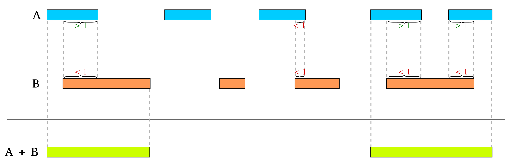

# mergeOverlappingRegions.sh

Searches for overlaps of the genomic regions of the between two files and generates merged regions bed file out of selected regions.

Usage: `mergeOverlappingRegions -a <bed/gff/vcf/bam> -b <bed/gff/vcf/bam> [-l <min overlap in bp>]`

Options:
*  `-a`  file A. Any format accepted by bedtools. Each feature in A is compared to B in search of overlaps.
*  `-b` files B. Any format accepted by bedtools. Use -b mutiple times to search overlaps of a in more than one file.
*  `-l` overlap. Value between 0 and 1. Minimum overlap between two regions from A and B respectively as a fraction of either region.

https://github.com/vidal-adrien/ChIP-Rx-Pipeline-Pub/blob/fa432adeb401e5924a48e93255b374c6791631d5/bash/mergeOverlappingRegions.sh#L1-L66